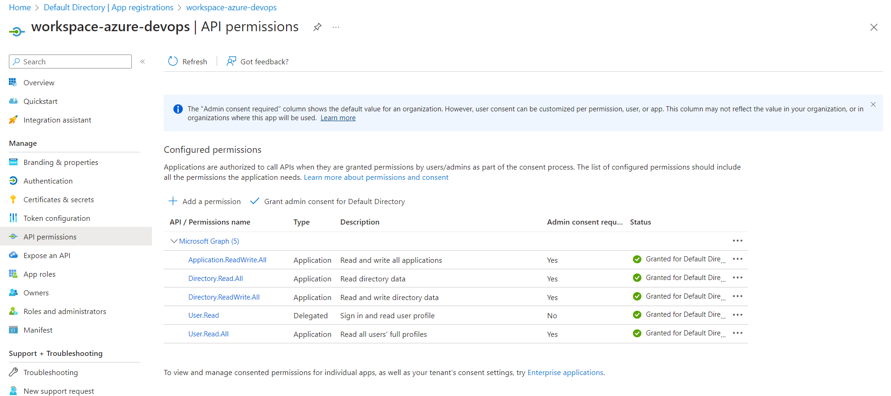

# Azure Devops Infra

Contanins terraform to create azure devops project with one service connection to azure

## Description

This will be use to create devops project with azure service connection. Terraform cloud is use to deploy the changes.

## Getting Started

### Dependencies

* Terraform 1.5.7

### Installing

* Clone the git repo
* Add a new module block in main.tf which will create the devops project

### Executing program

```
terraform login app.terraform.io
terraform init
terraform plan
terraform apply/destory
```
### CI/CD
https://app.terraform.io/app/enthuzest/workspaces/workspace-azure-devops

## Changes Done to Setup

* SP was created for workspace with secret.

* Below API Permissions granted in workspace service principal as SP is making update in another SP


* SP granted **Key Vault Secrets User** role to common key vault to read secret values

* Workspace secret added in terraform code for authentication

## Authors

Faraz Ahmad Siddiqui 
[@FarazAhmad](https://www.linkedin.com/in/faraz-ahmad-340001113/)

